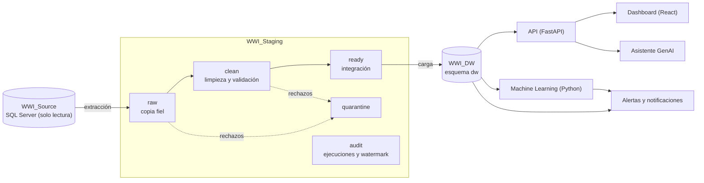
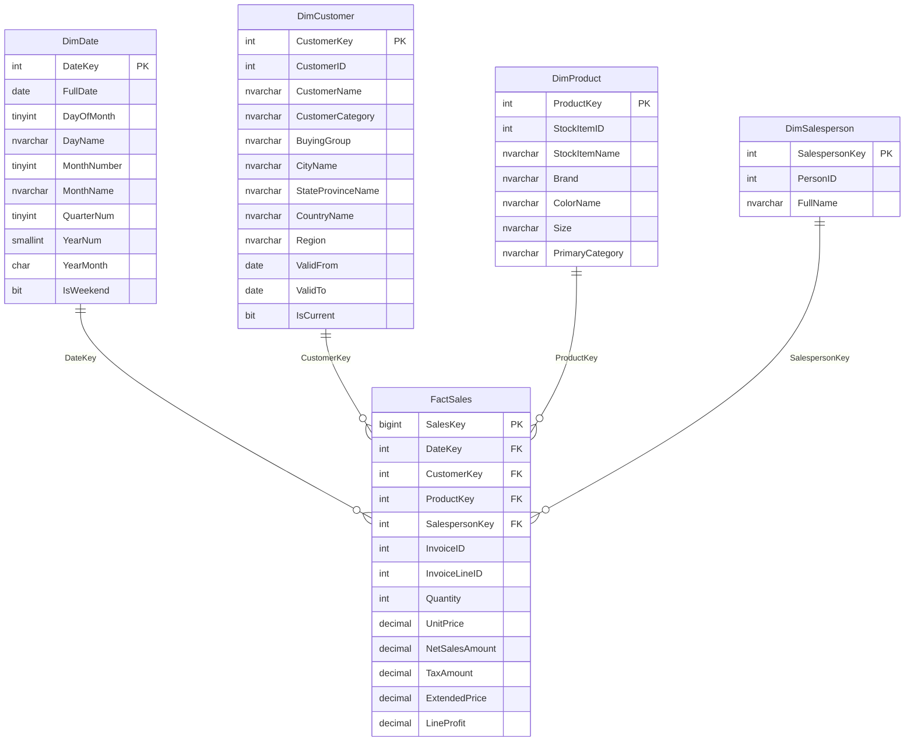
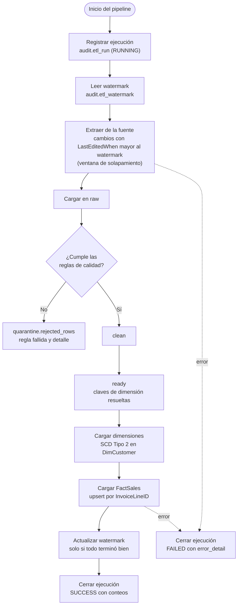
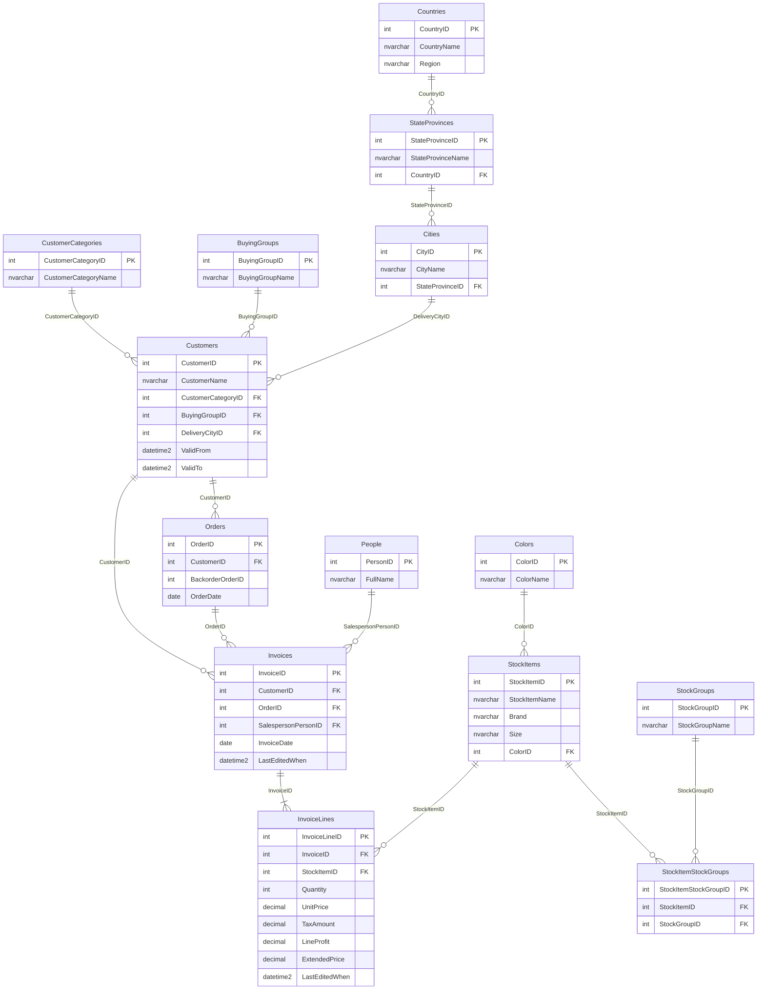

# Diagramas del proyecto

## 1. Arquitectura general

```mermaid
flowchart LR
    A[("WWI_Source<br/>SQL Server (solo lectura)")] -->|extracción| B
    subgraph STG["WWI_Staging"]
        B["raw<br/>copia fiel"] --> C["clean<br/>limpieza y validación"] --> D["ready<br/>integración"]
        B -.->|rechazos| Q["quarantine"]
        C -.->|rechazos| Q
        E["audit<br/>ejecuciones y watermark"]
    end
    D -->|carga| F[("WWI_DW<br/>esquema dw")]
    F --> G["API (FastAPI)"]
    G --> H["Dashboard (React)"]
    F --> I["Machine Learning (Python)"]
    G --> J["Asistente GenAI"]
    I --> K["Alertas y notificaciones"]
    F --> K
```

## 2. Modelo dimensional (esquema estrella)

```mermaid
erDiagram
    DimDate ||--o{ FactSales : "DateKey"
    DimCustomer ||--o{ FactSales : "CustomerKey"
    DimProduct ||--o{ FactSales : "ProductKey"
    DimSalesperson ||--o{ FactSales : "SalespersonKey"

    FactSales {
        bigint SalesKey PK
        int DateKey FK
        int CustomerKey FK
        int ProductKey FK
        int SalespersonKey FK
        int InvoiceID
        int InvoiceLineID
        int Quantity
        decimal UnitPrice
        decimal NetSalesAmount
        decimal TaxAmount
        decimal ExtendedPrice
        decimal LineProfit
    }

    DimDate {
        int DateKey PK
        date FullDate
        tinyint DayOfMonth
        nvarchar DayName
        tinyint MonthNumber
        nvarchar MonthName
        tinyint QuarterNum
        smallint YearNum
        char YearMonth
        bit IsWeekend
    }

    DimCustomer {
        int CustomerKey PK
        int CustomerID
        nvarchar CustomerName
        nvarchar CustomerCategory
        nvarchar BuyingGroup
        nvarchar CityName
        nvarchar StateProvinceName
        nvarchar CountryName
        nvarchar Region
        date ValidFrom
        date ValidTo
        bit IsCurrent
    }

    DimProduct {
        int ProductKey PK
        int StockItemID
        nvarchar StockItemName
        nvarchar Brand
        nvarchar ColorName
        nvarchar Size
        nvarchar PrimaryCategory
    }

    DimSalesperson {
        int SalespersonKey PK
        int PersonID
        nvarchar FullName
    }
```

## 3. Flujo ETL con carga incremental

```mermaid
flowchart TD
    S([Inicio del pipeline]) --> R["Registrar ejecución<br/>audit.etl_run (RUNNING)"]
    R --> W["Leer watermark<br/>audit.etl_watermark"]
    W --> X["Extraer de la fuente<br/>cambios con LastEditedWhen mayor al watermark<br/>(ventana de solapamiento)"]
    X --> RAW["Cargar en raw"]
    RAW --> V{"¿Cumple las<br/>reglas de calidad?"}
    V -- No --> Q["quarantine.rejected_rows<br/>regla fallida y detalle"]
    V -- Sí --> CL["clean"]
    CL --> RD["ready<br/>claves de dimensión resueltas"]
    RD --> DIM["Cargar dimensiones<br/>SCD Tipo 2 en DimCustomer"]
    DIM --> FACT["Cargar FactSales<br/>upsert por InvoiceLineID"]
    FACT --> OK["Actualizar watermark<br/>solo si todo terminó bien"]
    OK --> FIN["Cerrar ejecución<br/>SUCCESS con conteos"]
    X -. error .-> ERR["Cerrar ejecución<br/>FAILED con error_detail"]
    FACT -. error .-> ERR
```

## 4. ERD de la fuente (WWI_Source, tablas relevantes)

```mermaid
erDiagram
    Customers ||--o{ Invoices : "CustomerID"
    Customers ||--o{ Orders : "CustomerID"
    Orders ||--o{ Invoices : "OrderID"
    Invoices ||--|{ InvoiceLines : "InvoiceID"
    StockItems ||--o{ InvoiceLines : "StockItemID"
    StockItems ||--o{ StockItemStockGroups : "StockItemID"
    StockGroups ||--o{ StockItemStockGroups : "StockGroupID"
    Colors ||--o{ StockItems : "ColorID"
    People ||--o{ Invoices : "SalespersonPersonID"
    CustomerCategories ||--o{ Customers : "CustomerCategoryID"
    BuyingGroups ||--o{ Customers : "BuyingGroupID"
    Cities ||--o{ Customers : "DeliveryCityID"
    StateProvinces ||--o{ Cities : "StateProvinceID"
    Countries ||--o{ StateProvinces : "CountryID"

    Invoices {
        int InvoiceID PK
        int CustomerID FK
        int OrderID FK
        int SalespersonPersonID FK
        date InvoiceDate
        datetime2 LastEditedWhen
    }
    InvoiceLines {
        int InvoiceLineID PK
        int InvoiceID FK
        int StockItemID FK
        int Quantity
        decimal UnitPrice
        decimal TaxAmount
        decimal LineProfit
        decimal ExtendedPrice
        datetime2 LastEditedWhen
    }
    Orders {
        int OrderID PK
        int CustomerID FK
        int BackorderOrderID
        date OrderDate
    }
    Customers {
        int CustomerID PK
        nvarchar CustomerName
        int CustomerCategoryID FK
        int BuyingGroupID FK
        int DeliveryCityID FK
        datetime2 ValidFrom
        datetime2 ValidTo
    }
    StockItems {
        int StockItemID PK
        nvarchar StockItemName
        nvarchar Brand
        nvarchar Size
        int ColorID FK
    }
    Colors {
        int ColorID PK
        nvarchar ColorName
    }
    StockGroups {
        int StockGroupID PK
        nvarchar StockGroupName
    }
    StockItemStockGroups {
        int StockItemStockGroupID PK
        int StockItemID FK
        int StockGroupID FK
    }
    People {
        int PersonID PK
        nvarchar FullName
    }
    CustomerCategories {
        int CustomerCategoryID PK
        nvarchar CustomerCategoryName
    }
    BuyingGroups {
        int BuyingGroupID PK
        nvarchar BuyingGroupName
    }
    Cities {
        int CityID PK
        nvarchar CityName
        int StateProvinceID FK
    }
    StateProvinces {
        int StateProvinceID PK
        nvarchar StateProvinceName
        int CountryID FK
    }
    Countries {
        int CountryID PK
        nvarchar CountryName
        nvarchar Region
    }
```